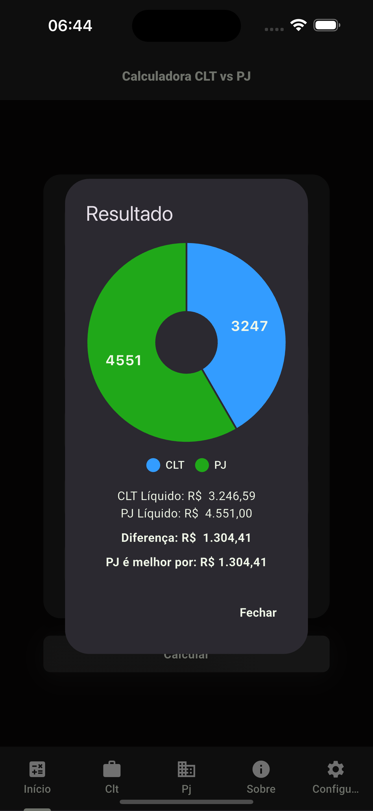
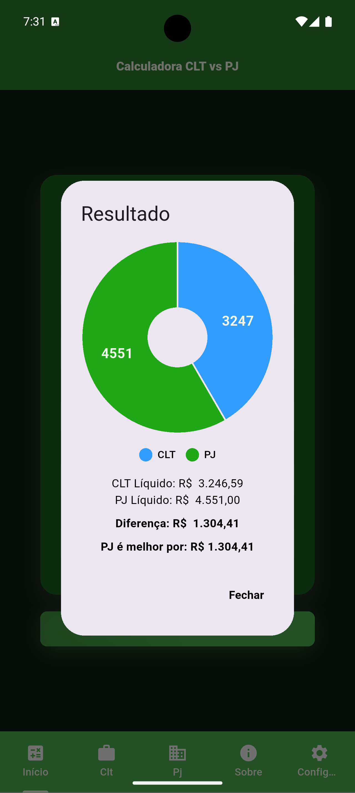
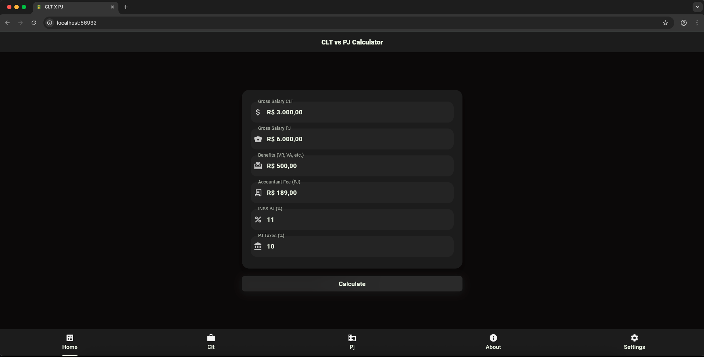

<h1 align="center" id="header">
 CLT x PJ App Flutter - Android/iOS - Web
</h1>

🤖 Stack:

- Dart
- Flutter
- Get Widget UI
- Google Fonts
- Locale Language EN / PT-BR / ES
- Dark Mode Provider
- Flutter local notifications
- Url Launcher
- Timezone
- Provider (State Managment)
- Flutter Secure Storage
- PierChart

 

⚙️ How to install:

Project Clone

     git clone https://github.com/Victor-Zarzar/cltxpj-flutter

Enter in directory:

     cd cltxpj-flutter

Open in your favorite editor(e.g. VSCode):

    code .

For install dependencies:

    flutter pub get

Run the app:

    flutter run

Run the app version Web:

    flutter run -d chrome    
    

### Archictecture:

### Version iOS:

 &nbsp; &nbsp; &nbsp;  &nbsp; &nbsp; &nbsp; 

### Version Android:

 &nbsp; &nbsp; &nbsp;  &nbsp; &nbsp; &nbsp; 

### Version Web:

